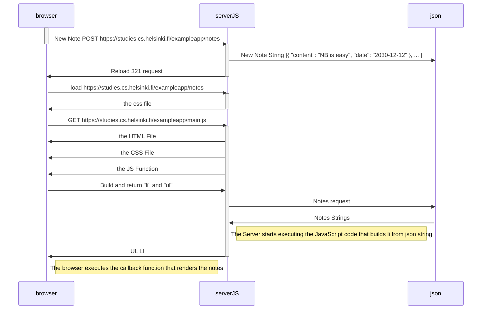

```mermaid
sequenceDiagram
    participant browser
    participant serverJS
    participant json

    activate browser
    browser->>serverJS: New Note POST https://studies.cs.helsinki.fi/exampleapp/notes
    deactivate browser
    activate serverJS
    serverJS->>json: New Note String [{ "content": "NB is easy", "date": "2030-12-12" }, ... ]
    serverJS->>browser:Reload 321 request
    deactivate serverJS
  
    activate browser
    browser->>serverJS: load https://studies.cs.helsinki.fi/exampleapp/notes
    activate serverJS
    serverJS->>browser: the css file
    deactivate serverJS

    browser->>serverJS: GET https://studies.cs.helsinki.fi/exampleapp/main.js
    activate serverJS
    serverJS->>browser: the HTML File
    serverJS->>browser: the CSS File
    serverJS->>browser: the JS Function
    browser->>serverJS: Build and return "li" and "ul"
    serverJS->>json: Notes request
    activate json
    json->>serverJS:Notes Strings
    Note right of serverJS: The Server starts executing the JavaScript code that builds li from json string
    serverJS->>browser: UL LI
    deactivate serverJS
    Note right of browser: The browser executes the callback function that renders the notes
  
```
