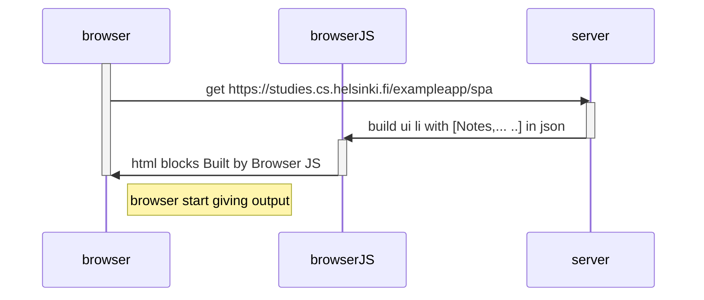

```mermaid
sequenceDiagram

    participant browser
    participant browserJS
    participant server
    
    activate browser
    browser->>server: get https://studies.cs.helsinki.fi/exampleapp/spa
    activate server
    server->> browserJS: build ui li with [Notes,... ..] in json
    deactivate server
    activate browserJS
    browserJS->>browser: html blocks Built by Browser JS
    deactivate browserJS
    deactivate browser
    note right of browser: browser start giving output

```
